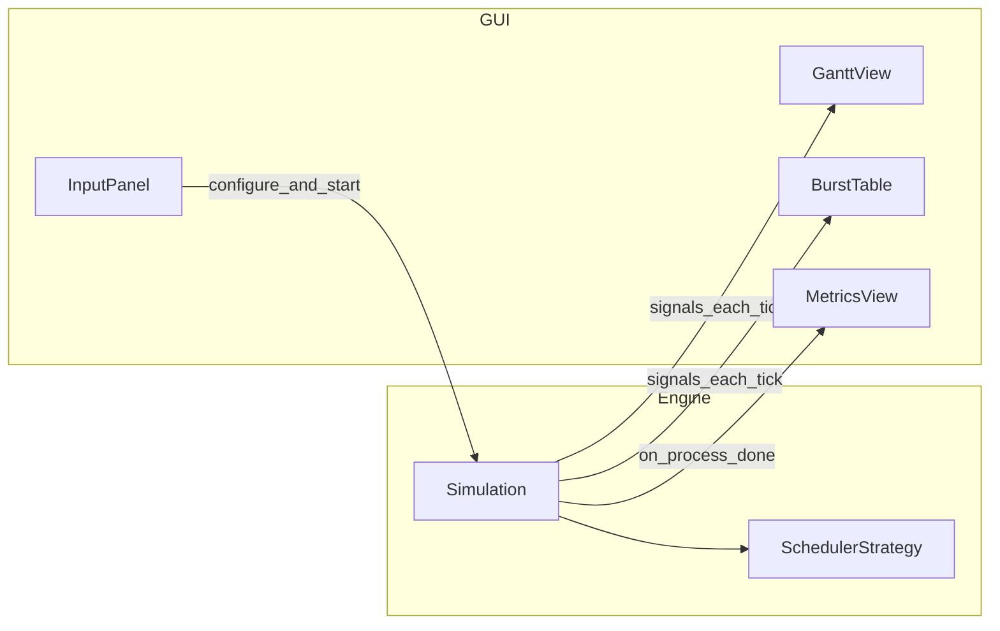

---

name: CPU Scheduler Team Plan
overview: A phased plan to deliver a GUI desktop CPU scheduler with multiple algorithms, live/batch modes, dynamic processes, Gantt + metrics + remaining-burst table, plus build artifacts (executable), documentation, and LMS submission materials for a 7-person team.
todos:

- id: kickoff-spec
content: Lock tech stack, Simulation/Process API, tie-break rules, RR quantum default
status: pending
- id: engine-batch
content: Implement FCFS, SJF (NP/P), Priority (NP/P), RR in engine with unit tests
status: pending
- id: ui-inputs
content: Build conditional input panel + dynamic add; validate per scheduler
status: pending
- id: ui-viz
content: Gantt view + burst table + metrics; wire to simulation state
status: pending
- id: live-mode
content: Add live tick (1s/unit), pause/resume; verify parity with batch mode
status: pending
- id: packaging
content: Package chosen stack to a runnable exe/installer; README; clean-Windows test
status: pending
- id: lms-deliverables
content: PDF report with names, architecture, screenshots; zip source + link to exe
status: pending
isProject: false

---

# CPU Scheduler Mini-Project — Team Plan (7 members)

## Goals (mapped to requirements)


| Requirement                                                         | Plan hook                                                                                                                                                   |
| ------------------------------------------------------------------- | ----------------------------------------------------------------------------------------------------------------------------------------------------------- |
| FCFS, SJF (NP/P), Priority (NP/P), RR                               | Single **scheduler engine** module with pluggable strategies + shared data structures                                                                       |
| Inputs: scheduler type, process count, **only fields needed**       | **Input wizard** driven by scheduler metadata (hide irrelevant fields)                                                                                      |
| **Dynamic add** while running                                       | Engine supports `add_process(...)` + live loop consumes events each tick                                                                                    |
| **1 time unit = 1 second** (live mode)                              | Timer-driven simulation loop with `QTimer` / equivalent                                                                                                     |
| **Batch mode** (no live delay)                                      | Same engine, `instant=True` or `tick_ms=0` path that advances until completion                                                                              |
| Gantt **live**, waiting/TA averages, **remaining burst** table live | Dedicated UI panels bound to engine state via signals/callbacks                                                                                             |
| **Executable**                                                      | Depends on stack — PyInstaller (Python), `dotnet publish` (C#), `jpackage` (Java), etc. — see [Tech stack options](#tech-stack-options-for-team-discussion) |
| **GUI desktop**                                                     | Any mature desktop framework; pick after team vote                                                                                                          |


## Tech stack options (for team discussion)

Choose **one** stack in the first kickoff. Use the criteria at the end to vote.

### Option A — Python 3.11+ + PySide6 (Qt6) + PyInstaller


| Pros                                                                       | Cons                                                   |
| -------------------------------------------------------------------------- | ------------------------------------------------------ |
| Fast UI work: forms, tables, `QTimer` for 1s ticks, custom paint for Gantt | PyInstaller sometimes needs extra hooks for Qt plugins |
| Scheduler engine in plain Python is easy to unit-test                      | Larger `.exe` / folder than a minimal native app       |
| Most teammates can contribute without a steep ramp                         |                                                        |


**Deliverable**: Windows `.exe` (one-file or one-folder) via PyInstaller; `requirements.txt` for source runs.

---

### Option B — C# + WPF + `dotnet publish` (Windows)


| Pros                                                                 | Cons                                                       |
| -------------------------------------------------------------------- | ---------------------------------------------------------- |
| Strong Windows desktop story; XAML + data binding for tables/metrics | Weaker fit if half the team has never used C#/XAML         |
| Single-file publish can be straightforward for small apps            | Primarily Windows-targeted (scope is usually fine for LMS) |
| Good performance for this problem size                               |                                                            |


**Deliverable**: Self-contained `.exe` from `dotnet publish`; `.csproj` + solution in repo.

---

### Option C — Java + JavaFX + jpackage


| Pros                                                          | Cons                                                                            |
| ------------------------------------------------------------- | ------------------------------------------------------------------------------- |
| Fits OOP-heavy course style; clear separation of engine vs UI | More boilerplate than Python for the same UI                                    |
| Cross-platform runtime                                        | jpackage and module-path setup can eat time if the team is weak on Java tooling |
| Tables and charts are workable in JavaFX                      |                                                                                 |


**Deliverable**: Platform installer or app image via `jpackage`; Maven or Gradle for builds.

---

### Option D — Electron (or Tauri) + web frontend


| Pros                                              | Cons                                                                                          |
| ------------------------------------------------- | --------------------------------------------------------------------------------------------- |
| Excellent if the team is strongest in HTML/CSS/JS | Heavier binary and more packaging moving parts for a small assignment                         |
| Rich chart libraries                              | Often **slower** to a stable desktop `.exe` than Qt/WPF unless you already ship Electron apps |


**Deliverable**: Packaged desktop app (e.g. Electron Builder); document Node version.

---

### How to decide (quick vote sheet)

Discuss and score 1–5 as a group:

1. **Team skill**: Which language does the majority already know well?
2. **Time risk**: Which stack gets a working Gantt + timer + table in the fewest days?
3. **Packaging**: Who has experience producing a runnable `.exe` on a clean Windows PC for submission?
4. **Course preference**: Does the instructor favor or require a specific language?

**Suggested default if the vote is tied**: **Option A (Python + PySide6)** for fastest integration and parallel work (engine vs UI).

---

## Repository layout (illustrative — Python / Option A)

If the team picks another stack, keep the **same separation**: `engine/` (pure scheduling) vs `ui/` (views only). File extensions and build files change accordingly.

```text
cpu-scheduler/
  src/
    engine/           # pure scheduling logic (no GUI imports)
      models.py       # Process, Event, State
      fcfs.py
      sjf.py          # np + preemptive variants
      priority.py
      round_robin.py
      simulation.py   # tick loop, preemption, arrivals, dynamic add
    ui/
      main_window.py
      gantt_view.py
      burst_table.py
      input_panel.py
  tests/
    test_engine_*.py
  build/
    pyinstaller.spec  # or equivalent for chosen stack
  README.md
requirements.txt      # or PackageReference / pom.xml / package.json
```

**Core design principle**: Keep **all scheduling rules and time advancement** in `engine/` so you can unit-test without the GUI. The GUI only renders state and forwards user actions.

---

## Scheduling engine — behavior contract

Define a small **Simulation API** everyone agrees on early:

- **Process fields** (union by mode): `pid`, `arrival_time`, `burst_time`, optional `priority` (only Priority), optional `remaining` (runtime mirror).
- **Per tick** (live or batch): determine running process, record Gantt segment `(pid, start, end)` or append to current segment if same process continues.
- **Preemption**: on each tick (or on event boundaries for efficiency), compare according to rule (SJF: shortest remaining; Priority: smallest priority number wins).
- **RR**: maintain ready queue; quantum = 1 unit unless spec says otherwise — **confirm quantum input** in UI (default 1).
- **Dynamic add**: new process gets `arrival_time = current_time` (or user-specified arrival if you allow — simplest is “add now”).
- **Completion**: when `remaining == 0`, move to finished; compute per-process **waiting** and **turnaround** using standard definitions (TA = finish − arrival; waiting = TA − burst).

**Edge cases to decide in Week 1** (document in report): tie-breaking (same burst/priority), idle CPU (no process ready), processes arriving at same time.

---

## GUI — screens and live updates

1. **Setup panel**: scheduler type → show only needed columns (FCFS: no priority; SJF: no priority; etc.). Initial process list + “Add process” in live mode.
2. **Controls**: Start / Pause / Reset; toggle **Live (1s/unit)** vs **Run all at once** (batch).
3. **Gantt chart**: horizontal timeline; each tick extends or adds a segment; color per PID.
4. **Metrics bar**: rolling **average waiting** and **average turnaround** (for completed processes so far, or final — **specify**: show **current averages for completed subset** during run, final when done).
5. **Remaining burst table**: sortable table: PID, original burst, remaining, state (Ready/Running/Finished).

**Binding pattern**: Engine emits `state_changed` after each tick; UI refreshes tables and Gantt incrementally (avoid full redraw if possible for performance).




---

## Testing strategy (required for confidence before demo)

- **Unit tests** per algorithm on **fixed traces** (small integer times): expected Gantt order, waiting, TA.
- **Property checks** where easy: sum of CPU busy + idle spans equals total simulated time.
- **Regression folder**: save 3–5 JSON fixtures `{scheduler, processes, expected_metrics}`.

---

## Build and deliverable packaging

1. **Pinned dependencies** (`requirements.txt` + optional lockfile).
2. **CI optional**: GitHub Actions running `pytest` on push.
3. **Executable**: Build with chosen tool (e.g. PyInstaller one-folder/one-file, `dotnet publish`, `jpackage`); test on a **clean Windows VM** (DLL/runtime issues are common).
4. **LMS zip contents** (checklist):
  - `report.pdf` (names, student IDs, architecture, algorithms, screenshots, assumptions)
  - `source/` full code
  - `README` with how to run from source + link to Drive **exe**
  - Screenshot folder (Gantt live, each scheduler type, batch vs live)

---

## 7-person work split (roles + ownership)

Rotate **code review pairs** so knowledge spreads. Use a **single main branch** + short PRs.


| Person                                  | Primary ownership                                                   | Deliverables                                            |
| --------------------------------------- | ------------------------------------------------------------------- | ------------------------------------------------------- |
| **1 — Tech lead / Integration**         | Architecture, `Simulation` API, merges, resolves integration issues | `simulation.py` glue, coding standards, final exe build |
| **2 — FCFS + Round Robin**              | `fcfs.py`, `round_robin.py`, tests                                  | Algorithms + fixtures                                   |
| **3 — SJF (NP + P)**                    | `sjf.py`, preemption logic, tests                                   | Edge cases (ties, arrivals)                             |
| **4 — Priority (NP + P)**               | `priority.py`, tests                                                | Clarify smaller number = higher priority in UI labels   |
| **5 — Input UI + dynamic add**          | `input_panel.py`, validation, conditional fields                    | No unused prompts; add-process dialog                   |
| **6 — Gantt + live timing**             | `gantt_view.py`, timer wiring, pause/resume                         | Live chart, 1 unit = 1 s                                |
| **7 — Tables + metrics + report draft** | `burst_table.py`, averages display, screenshots, PDF first draft    | LMS zip assembly, screenshot capture                    |


Module names above assume **Option A (Python)**; map to equivalent files/classes if the team picks C#, Java, or Electron.

**Shared**: Everyone runs tests locally before PR; Person 1 runs integration test day mid-project.

---

## Timeline (deadline 17/4/2026 — assume start ~10/4/2026; adjust if you start earlier)

**Week 1 (Days 1–3)**  

- Kickoff: choose stack, repo, agree on Process/Simulation API and tie-break rules.  
- Persons 2–4: stub schedulers + tests skeleton.  
- Persons 5–7: UI shell (empty panels).  
- Person 1: `Simulation` skeleton with batch-only tick loop.

**Week 2 (Days 4–7)**  

- Complete all algorithms in **batch mode** first (Persons 2–4 + Person 1).  
- Input panel with conditional fields (Person 5).  
- Gantt + table read-only from simulated final trace (Persons 6–7).  
- Mid-milestone: **batch demo** with all schedulers.

**Week 3 (buffer / polish)**  

- Live mode + dynamic add (Persons 1, 5, 6).  
- Packaged exe/installer + README (Person 1 + 7), using the stack chosen at kickoff.  
- Report PDF + screenshots (Person 7 + all contribute sections).  
- Final QA on Windows.

---

## Risks and mitigations

- **Scope creep**: Lock “quantum = user input default 1” and “dynamic add = arrive now” unless time permits.  
- **Live performance**: For many processes, update Gantt incrementally, not full repaint from scratch each second.  
- **Wrong metrics**: Cross-validate with manual calculation on tiny examples in the report.  
- **Exe failures**: Budget half a day for packaging issues (e.g. PyInstaller Qt plugins, .NET runtime bundling, jpackage config).

---

## Definition of done (team checklist)

- All five scheduler modes behave correctly on shared test fixtures.  
- UI never asks for irrelevant fields.  
- Live and batch modes both work; remaining burst table updates correctly.  
- Gantt and averages match batch output for the same input.  
- Executable (or installer) runs on a target PC without dev tools installed — per chosen stack (e.g. no Python on PATH for a PyInstaller build).  
- Zip + PDF + Drive link ready for LMS.

